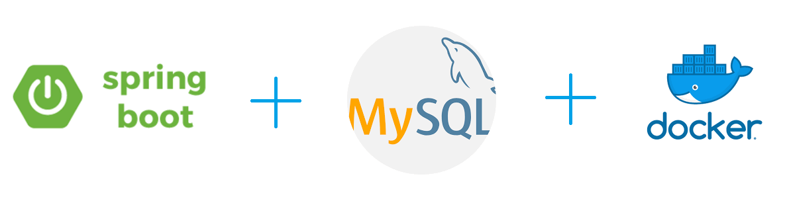

# docker-mysql-springboot-demo 

This project has been developed to demonstrate how to 
**dockerize** the **SpringBoot App** and **MySQL database**.

### Requirements To Run Application Without Docker
* JDK 11
* MySQL

### Dependencies And Tools Used To Build Application
* Git
* JDK 11
* Spring Boot
* data-jpa
* starter-web
* Maven
* Lombok
* MapStruct
* Swagger

**For detailed information refer to pom.xml**

### How to dockerize SpringBoot App & MySQL
**Note: you must have some knowledge of docker as I am not going to explain in detail here, if you have any queries you can 
ask me.**

* There is a **Dockerfile** in the root directory `docker-mysql-springboot-demo`, 
this is used to dockerize the SpringBoot App 

* There is a script **wait-for-mysql.sh**, available in the 
`docker-mysql-springboot-demo` directory, which is helping us to 
start the **SpringBoot App** once the **MySQL** is ready to 
accept connections. You can see I have used this script in the 
**Dockerfile**.

* The last and most important file is **docker-compose.yml**, 
which is available in the `docker-mysql-springboot-demo` 
directory, this file contains the configuration which will start 
the **SpringBoot App** and **MySQL** and make them connected.

### Start the Application with the help of Docker
Go to the `docker-mysql-springboot-demo` directory and execute 
the following command in the terminal

    docker-compose up
    
And we are done, the **SpringBoot App** will be starting on port 
**8081** and **MySQL** is on **3307**

Now you can open the swagger to access the APIs: 
[Swagger](http://localhost:8081/swagger-ui/#/)  

Similarly, you can dockerize your application with MySQL.

  <b>Thank You :)</b>

 
